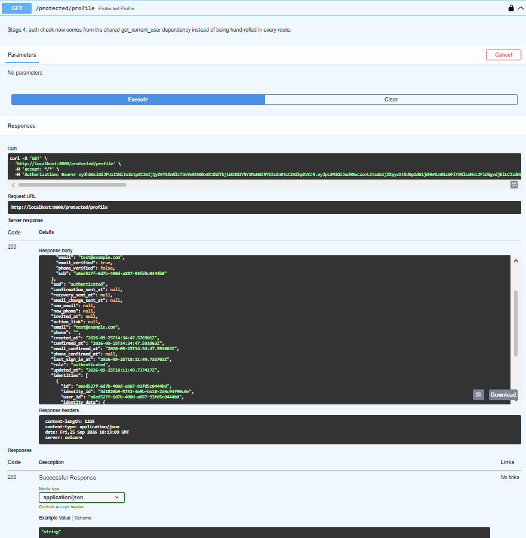

# FlyRank Auth API

A secure FastAPI backend that uses [Supabase Auth](https://supabase.com/docs/guides/auth) as an
external identity provider — signup/login issue real Supabase-managed JWTs, and every protected
route verifies that token against Supabase on every request (no local session store, no JWT
secret to manage yourself).

Built for the FlyRank Internship — Backend Track, Week 2, Assignment A4 ("Auth · Login &
protect").

## Stack

- **FastAPI** — routing, request validation, auto-generated OpenAPI/Swagger docs
- **Supabase Auth** (`supabase-py` SDK) — signup, login, token verification, logout
- **Uvicorn** — ASGI server

## Setup

1. **Clone and install dependencies**

   ```bash
   git clone https://github.com/720-hz/flyrank-auth-api.git
   cd flyrank-auth-api
   pip install -r requirements.txt
   ```

2. **Create a Supabase project** at [supabase.com](https://supabase.com) (free tier is enough).
   From your project's **Settings → API** page, grab the **Project URL** and the **anon public
   key**.

3. **Configure environment variables**

   ```bash
   cp .env.example .env
   ```

   Then edit `.env`:

   ```
   SUPABASE_URL=your_project_url
   SUPABASE_KEY=your_anon_key
   PORT=8000
   ```

4. *(Recommended for local testing)* In your Supabase dashboard, go to **Authentication →
   Providers → Email** and turn **off** "Confirm email". Supabase's free shared email service has
   a very low sending rate limit, so disabling confirmation avoids `"email rate limit exceeded"`
   errors while testing signup repeatedly. Not required in production if you configure your own
   SMTP provider.

## Run

```bash
python main.py
```

You should see:

```
Server running and connected to Supabase
INFO:     Uvicorn running on http://0.0.0.0:8000
```

The API is now live at `http://localhost:8000`, and interactive docs at
`http://localhost:8000/docs`.

## Endpoints

| Method | Route                  | Auth required | Description                                                    | Success | Failure cases |
|--------|-------------------------|:-------------:|------------------------------------------------------------------|:-------:|---------------|
| POST   | `/auth/signup`           | No            | Create a new Supabase user with email + password                 | `201`   | `400` missing fields, `400` Supabase error (e.g. user exists) |
| POST   | `/auth/login`            | No            | Authenticate and receive an `access_token` / `refresh_token`     | `200`   | `400` missing fields, `401` invalid credentials |
| POST   | `/auth/logout`           | Yes (Bearer)  | Revoke the given access token via Supabase                       | `204`   | `401` missing/invalid token |
| GET    | `/public/info`           | No            | Public sanity-check route                                        | `200`   | — |
| GET    | `/protected/profile`     | Yes (Bearer)  | Returns the verified caller's Supabase user metadata              | `200`   | `401` missing/invalid/expired token |
| GET    | `/protected/dashboard`   | Yes (Bearer)  | Second protected route, proves the auth dependency is reusable   | `200`   | `401` missing/invalid/expired token |

### Authentication

Protected routes expect a standard Bearer token, obtained from `/auth/login`'s `access_token`:

```
Authorization: Bearer <access_token>
```

The token is verified against Supabase on every request via `supabase.auth.get_user(token)` —
there's no local JWT decoding/secret, so a token revoked or expired on Supabase's side is
rejected immediately.

## Try it with curl

```bash
# Sign up
curl -i -X POST http://localhost:8000/auth/signup \
  -H "Content-Type: application/json" \
  -d '{"email":"test@example.com","password":"password123"}'

# Log in
curl -i -X POST http://localhost:8000/auth/login \
  -H "Content-Type: application/json" \
  -d '{"email":"test@example.com","password":"password123"}'
# -> copy the "access_token" from the response

# Call a protected route
curl -i http://localhost:8000/protected/profile \
  -H "Authorization: Bearer <paste access_token here>"

# Log out
curl -i -X POST http://localhost:8000/auth/logout \
  -H "Authorization: Bearer <paste access_token here>"
```

## Try it with Swagger UI

Open `http://localhost:8000/docs`. Every protected route is marked with a padlock icon. Log in
via `/auth/login` to get an `access_token`, click the green **Authorize** button at the top,
paste the token (no `Bearer ` prefix needed), and click **Authorize**. From then on, **Try it
out → Execute** on any protected route sends the token automatically:



## Reusable auth dependency

The token-verification logic lives in one place, [`auth.py`](auth.py), as a FastAPI dependency:

```python
def get_current_user(credentials: HTTPAuthorizationCredentials = Depends(bearer_scheme)):
    ...
    result = supabase.auth.get_user(credentials.credentials)
    ...
    return result.user
```

Every protected route — `/protected/profile`, `/protected/dashboard`, `/auth/logout` — just adds
`user = Depends(get_current_user)` to its signature. There's no duplicated header-parsing or
token-verification code anywhere in `main.py`.

## Project structure

```
.
├── main.py       # FastAPI app and all routes
├── auth.py       # Reusable get_current_user auth dependency
├── config.py     # Loads .env and creates the shared Supabase client
├── requirements.txt
├── .env.example
└── screenshots/
    └── swagger-authorize.png
```

## Commit history

Built and committed stage by stage, each one tested against a live Supabase project before
moving on:

1. **Stage 0** — Supabase client setup, server boots and connects
2. **Stage 1** — `/auth/signup` and `/auth/login`
3. **Stage 2** — `/public/info` and a `/protected/profile` auth-header stub
4. **Stage 3** — real Supabase token verification on `/protected/profile`
5. **Stage 4** — auth check extracted into a reusable dependency, `/auth/logout`, and
   `/protected/dashboard`
6. **Stage 5** — Swagger UI Authorize flow wired up and documented
